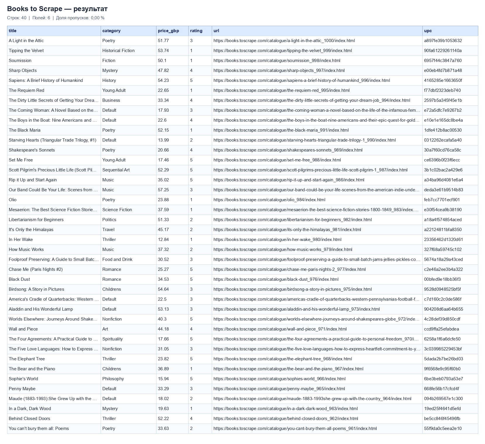
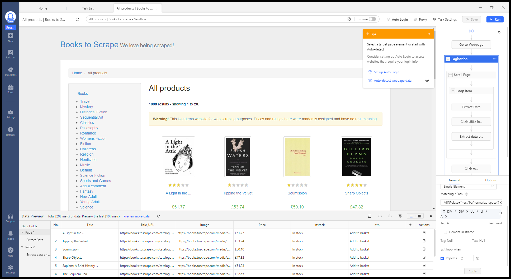
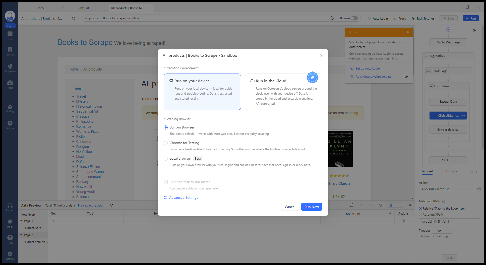
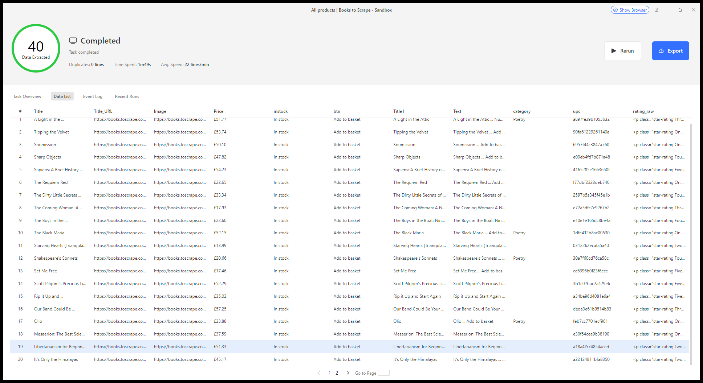
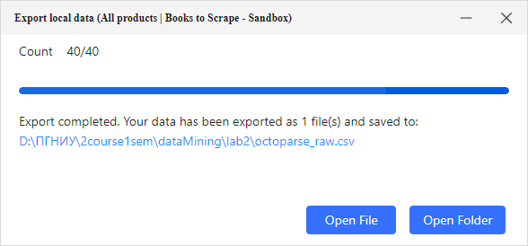

# Лабораторная 2. Отчёт

Источник: [Books to Scrape](https://books.toscrape.com/).
Собраны 40 книг с двух страниц каталога через BeautifulSoup и Octoparse.

## BeautifulSoup

[scraper.py](scraper.py) получает HTML через requests, разбирает карточки и открывает
страницы книг для получения категории и UPC.

| Поле | Правило поиска | Тип в программе |
|---|---|---|
| `title` | Атрибут `title` у `h3 a` внутри `article.product_pod` | `str` |
| `category` | Предпоследний элемент `ul.breadcrumb li` на странице книги | `str` |
| `price_gbp` | Число из `p.price_color` без знака валюты | `float` |
| `rating` | Класс `One`…`Five` у `p.star-rating`, преобразованный в 1…5 | `int` |
| `url` | `href` у `h3 a`, преобразованный в абсолютную ссылку через `urljoin` | `str` |
| `upc` | Строка `UPC` в `table.table.table-striped` на странице книги | `str` |

UPC хранится как строка, чтобы не потерять начальные нули.
Пробелы и переводы строк очищаются. Дубли удаляются по UPC, а если его нет — по URL.
Следующая страница находится по `li.next a`. Лимит относится к уникальным книгам.

Тайм-аут запроса — 10 секунд. При временных сетевых ошибках и HTTP 429/500/502/503/504
запрос повторяется до двух раз с паузами 0,5 и 1 секунда. HTTP 404 не повторяется.

Команды запуска приведены в [README](README.md).
Результат: [books.csv](books.csv), 40 строк, 6 полей, без дублей и пропусков.

Первые пять книг:

| Название | Категория | Цена, GBP | Рейтинг | UPC |
|---|---|---:|---:|---|
| [A Light in the Attic](https://books.toscrape.com/catalogue/a-light-in-the-attic_1000/index.html) | Poetry | 51.77 | 3 | a897fe39b1053632 |
| [Tipping the Velvet](https://books.toscrape.com/catalogue/tipping-the-velvet_999/index.html) | Historical Fiction | 53.74 | 1 | 90fa61229261140a |
| [Soumission](https://books.toscrape.com/catalogue/soumission_998/index.html) | Fiction | 50.10 | 1 | 6957f44c3847a760 |
| [Sharp Objects](https://books.toscrape.com/catalogue/sharp-objects_997/index.html) | Mystery | 47.82 | 4 | e00eb4fd7b871a48 |
| [Sapiens: A Brief History of Humankind](https://books.toscrape.com/catalogue/sapiens-a-brief-history-of-humankind_996/index.html) | History | 54.23 | 5 | 4165285e1663650f |

## Octoparse

Использована задача `All products | Books to Scrape - Sandbox` в Octoparse 10.1.1.

### Настройка

1. `Go to Webpage` открывает первую страницу каталога.
2. `Loop Item` обходит карточки книг.
3. `Extract Data` получает цену и ссылку из карточки.
4. `Click URLs in the list` открывает страницу книги по `/article[1]/h3[1]/a[1]`.
5. `Extract data on the detail page` получает полное название, UPC и HTML рейтинга.
6. `Click to Paginate` нажимает next по XPath `//li[@class="next"]/a[normalize-space(.)="next"]`.

В `Pagination` установлено `Repeats = 2`: две страницы по 20 книг.

| Итоговое поле | Поле Octoparse | Содержимое |
|---|---|---|
| `title` | `Title1` | Полное название из `h1` на странице книги |
| `price_gbp` | `Price` | Цена из карточки |
| `rating` | `rating_raw` | HTML элемента `p.star-rating` с классом `One`…`Five` |
| `url` | `Title_URL` | Ссылка на книгу |
| `upc` | `upc` | UPC из первой строки таблицы сведений о книге |

`Title` содержит сокращённые названия у 22 книг, поэтому использовано `Title1`.
Поле категории заполнено только для пяти книг из Poetry и исключено из итогового CSV.

### Запуск и экспорт

Выбраны `Run on your device` и `Built-in Browser`, затем `Run Now`.

Задача завершилась со статусом Completed: 40 строк за 1 минуту 49 секунд, дублей нет.

Через `Export → CSV → Confirm` сохранён [octoparse_raw.csv](octoparse_raw.csv):
40 строк, 11 исходных полей.

[normalize_octoparse.py](normalize_octoparse.py) выбирает пять полей, очищает пробелы,
преобразует цену в float и рейтинг в число от 1 до 5. Дубли удаляются по UPC.
Пустые обязательные поля, неверные числа и противоречивые дубли вызывают ошибку.

Очищенный результат — [octoparse_books.csv](octoparse_books.csv): 40 строк, 5 полей,
без дублей и пропусков.

## Сравнение

[compare_results.py](compare_results.py) сравнивает таблицы по UPC.

| Показатель | BeautifulSoup | Octoparse после очистки |
|---|---:|---:|
| Страниц каталога | 2 | 2 |
| Строк | 40 | 40 |
| Уникальных UPC | 40 | 40 |
| Полей | 6 | 5 |
| Доля пропусков | 0,00 % | 0,00 % |

У всех 40 книг совпадают `title`, `price_gbp`, `rating`, `url` и `upc`.
В таблице BeautifulSoup дополнительно сохранена категория.
