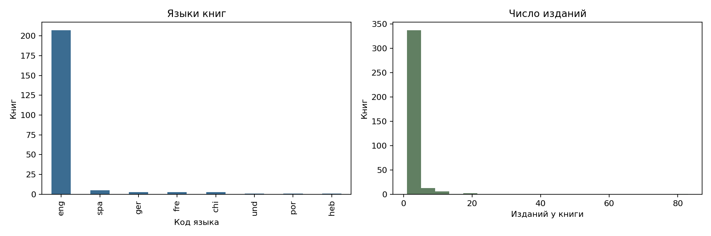
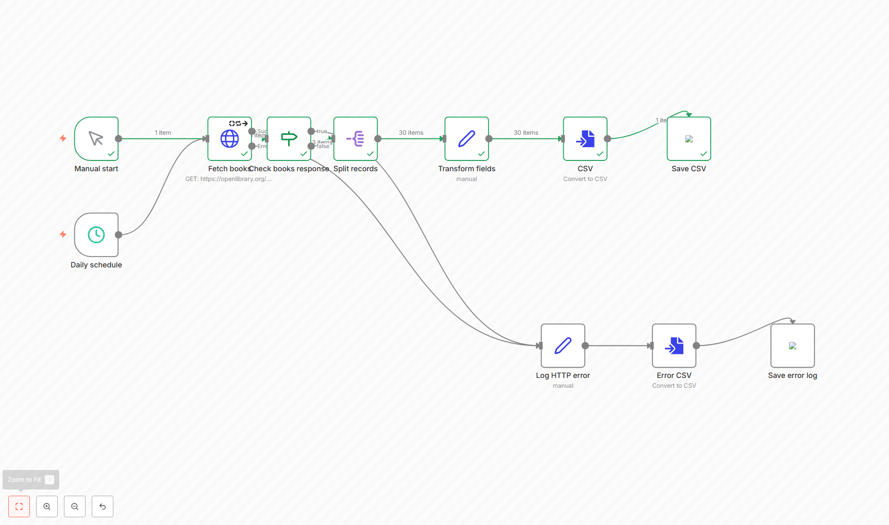
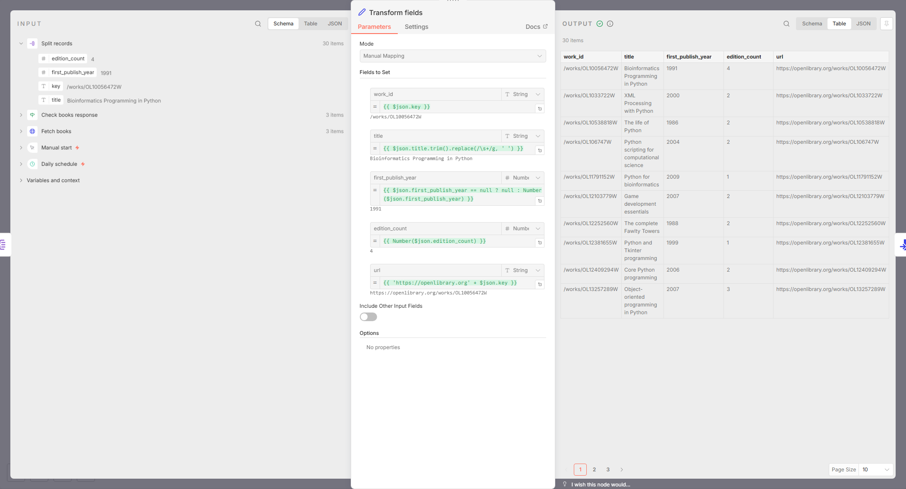

# Лабораторная 3. Отчёт

Вариант 3. Через Open Library собраны 360 книг по запросу `python programming`
и сведения об их авторах.

## API и сбор

| Параметр | Search API | Authors API |
|---|---|---|
| Адрес | openlibrary.org/search.json | openlibrary.org/authors/ID.json |
| Назначение | Поиск книг | Сведения об авторе |
| Пагинация | offset и limit | Одна запись на запрос |
| Авторизация | Не требуется | Не требуется |
| Версия | Не указана в URL | Не указана в URL |
| Ключ | key книги | key автора |
| Даты | Год издания — число | last_modified.value — ISO 8601 |

Схема: поиск книг → обработка полей → запросы об авторах → объединение → проверка → CSV.

Весь код находится в [collect.py](collect.py). Используется requests.Session,
тайм-аут 20 секунд и пауза 1,1 секунды между запросами.
Скрипт проверяет HTTP-статус и Content-Type перед разбором JSON.

Пагинация использует offset и limit: по 90 записей, максимум 360 книг и 20 страниц.
Offset увеличивается на число полученных записей. Остановка — по пустому ответу,
общему числу найденных книг или заданному лимиту. Получены четыре страницы.

HTTP 429 и 5xx повторяются до двух раз. Задержка увеличивается после каждой попытки;
учитывается Retry-After. Остальные 4xx не повторяются.
В [collection_log.csv](collection_log.csv) записаны параметры, статус, время и объём ответа.

## Обработка и качество

JSON обработан через `pandas.json_normalize`. Языки вынесены в отдельную таблицу
[book_languages.csv](book_languages.csv): 225 связей книг и языков.
Данные автора присоединяются по `author_key` с проверкой `many_to_one`.
До и после объединения — 360 книг. Сведения об авторе найдены для 357 книг.

Числа приведены к числовым типам, время — к UTC.
Проверены число изданий, год публикации, формат ключа и наличие названия. Нарушений нет.

| Поле | Полнота, % |
|---|---:|
| work_id | 100.00 |
| title | 100.00 |
| first_publish_year | 100.00 |
| edition_count | 100.00 |
| author_key | 99.17 |
| author_name_catalogue | 99.17 |
| author_count | 100.00 |
| language_count | 100.00 |
| languages | 60.00 |
| collected_at | 100.00 |
| url | 100.00 |
| author_name_verified | 99.17 |
| author_revision | 99.17 |
| author_modified_at | 99.17 |
| author_url | 99.17 |
| author_matched | 100.00 |

Уникальных ключей — 360, дублей — 0, пустых обязательных полей — 0.
Исходные записи — [data_raw.jsonl](data_raw.jsonl), итог — [data_clean.csv](data_clean.csv).

[state.json](state.json) хранит обработанные ключи и позицию последнего завершённого сбора.
При повторном запуске новых книг не было, содержимое CSV не изменилось.
Ответы Authors API берутся из кэша.

## n8n

[Workflow](nocode/workflow.json) получает три страницы Search API, проверяет ответ,
разделяет записи, преобразует поля и сохраняет CSV. Ошибки записываются отдельно.

Получены 30 книг в [nocode_result.csv](nocode/nocode_result.csv).
Название, число изданий и ссылка совпадают с Python.
Сведения об авторах в этом workflow не добавляются.

## Сравнение

| Показатель | Python | n8n |
|---|---:|---:|
| Подготовка до первой выгрузки, мин | 5.88 | 0.65 |
| Записей | 360 | 30 |
| Время прогона, с | 348.81 | 13.34 |
| HTTP-запросов | 310 | 3 |
| Объём тел ответов, МБ | 0.172 | 0.004 |
| Пагинация | Лимиты страниц и записей | HTTP Request |
| Ошибки | Статус, тип ответа, повторы, журнал | Повторы узла, проверка структуры, лог |
| Повторный запуск | 0 новых записей | Повторная выгрузка CSV |
| Версионирование | Python, notebook, Git | Экспорт JSON, Git |
| Порог входа, 1–5, субъективно | 4 | 2 |

Время подготовки измерено от начала записи кода или workflow до первой выгрузки,
без установки окружения. Объём ответов указан без HTTP-заголовков.
Python собирает 360 книг с авторами, n8n — 30 книг без авторов,
поэтому время полного запуска нельзя сравнивать напрямую.

Повторный запуск Python занял 8,67 секунды и сделал 4 запроса.
Оба способа запускались локально, платные API и облачные сервисы не использовались.
При 100 таких запусках расходы связаны с работой компьютера.

Для полной таблицы и повторного сбора выбран Python.
Для небольшой выгрузки по расписанию подходит n8n.
Можно оставить обработку в Python, а расписание и запись ошибок — в n8n.

## Условия использования

Использован публичный API Open Library, запросы выполняются с паузами, ответы авторов кэшируются.
[Лимиты API](https://openlibrary.org/developers/api) и
[условия использования данных](https://openlibrary.org/developers/licensing) нужно учитывать при расширении сбора.

Имена авторов могут относиться к персональным данным; контакты не собирались.
В правовой оценке учтён п. 8 ч. 1 ст. 6 [152-ФЗ](https://mintrud.gov.ru/docs/laws/130):
научная деятельность допускается при соблюдении прав и законных интересов человека.
Открытый доступ к API сам по себе не разрешает любое дальнейшее использование сведений.
Сырые ответы предлагается хранить до проверки работы и удалить не позднее чем через 30 дней после неё.

Источники: [Search API](https://openlibrary.org/dev/docs/api/search), [Authors API](https://openlibrary.org/dev/docs/api/authors), [HTTP Request n8n](https://docs.n8n.io/integrations/builtin/core-nodes/n8n-nodes-base.httprequest/).
