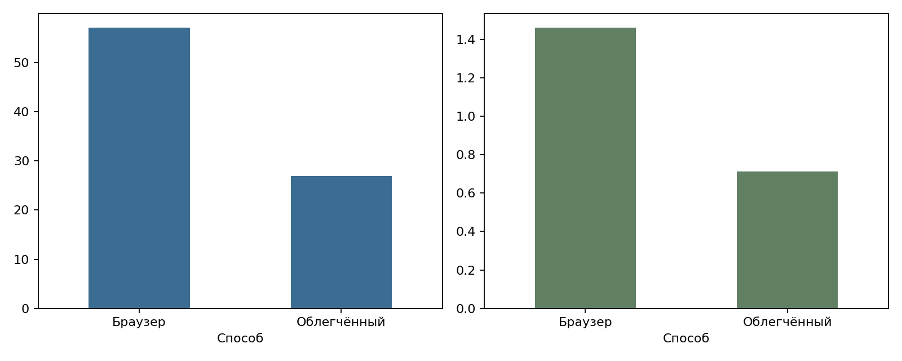
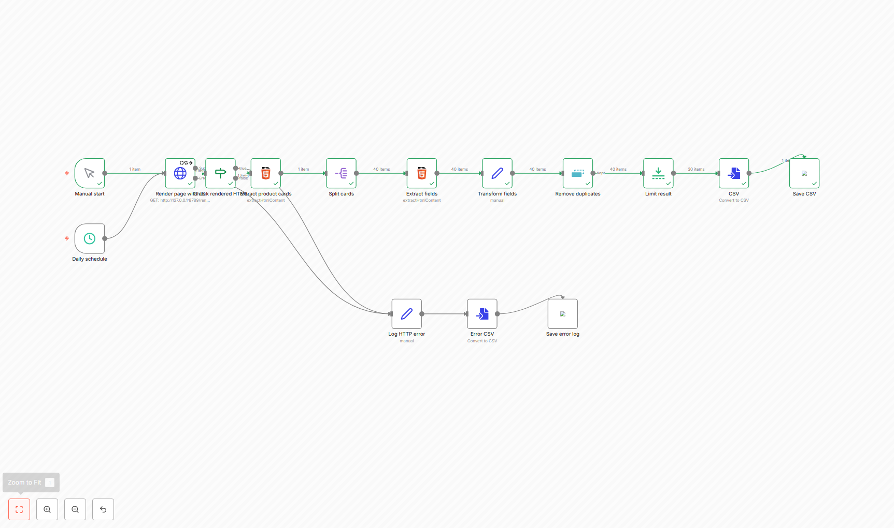
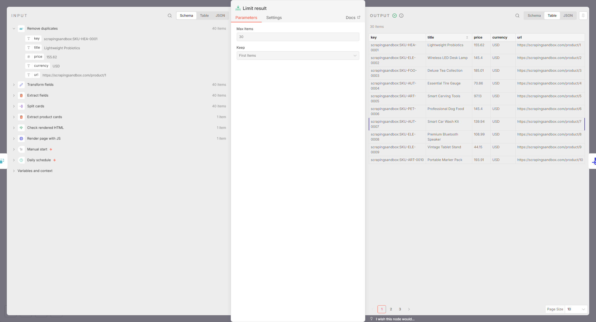

# Лабораторная 4. Отчёт

Вариант 3. На ScrapingCourse найдено 147 уникальных товаров.
Для набора от 200 записей добавлен ScrapingSandbox.
Итог — 347 товаров: 147 и 200 соответственно.

## Диагностика страниц

| Источник | Размер HTML, байт | Карточек в HTML | Карточек без JS до и после прокрутки |
|---|---:|---:|---|
| scrapingcourse | 18998 | 12 | 12 → 12 |
| scrapingsandbox | 122371 | 20 | 20 → 20 |

Исходный HTML содержит только первую порцию товаров.
При отключённом JavaScript прокрутка не добавляет карточки.
HTML и скриншоты сохранены в [artifacts](artifacts).

ScrapingCourse загружает HTML через `GET /ajax/products?offset=0,10,20…`.
В конце сервер отвечает HTTP 204. Некоторые порции пересекаются, поэтому товары
проверяются по уникальному ключу.

ScrapingSandbox добавляет карточки из клиентского JavaScript.
Отдельный XHR с товарами и полный набор данных в исходном HTML не найдены.

## Playwright

[collect.py](collect.py) открывает браузер, прокручивает страницу, извлекает поля
и сохраняет CSV. Browser, context и page закрываются после сбора и при ошибке.

| Локатор | Назначение | Поведение при изменениях |
|---|---|---|
| .product-item / a.product-card | Карточка | Переименование класса требует поправки; дополнительная обёртка внутри карточки не мешает |
| .product-name | Название | Обёртка вокруг текста не мешает; при смене класса нужен новый семантический селектор |
| .product-price / .price | Цена | Не зависит от языка названия; при смене класса требуется обновление |

После прокрутки скрипт ждёт увеличения числа карточек через `wait_for_function`.
Ограничения: 35 итераций, три прокрутки без новых товаров и 200 записей на источник.
Пауза 250 мс ограничивает частоту прокрутки; она не заменяет ожидание карточек.

Поля извлекаются одним вызовом `eval_on_selector_all`.
Сравнение с извлечением по одной карточке на одинаковых 50 товарах:

| Источник | Поэлементно, с | Массово, с | Отношение времени |
|---|---:|---:|---:|
| scrapingcourse | 0.2369 | 0.0060 | 39.21 |
| scrapingsandbox | 0.3865 | 0.0082 | 47.18 |

При тайм-ауте сохраняются HTML, скриншот и текст ошибки.
Пример — [artifacts/timeout_test](artifacts/timeout_test).
Скрипт завершает работу с ненулевым кодом.

## Сбор с меньшим числом загрузок

Для ScrapingCourse используются requests к найденному XHR, паузы и повторы HTTP 429/5xx.
Для ScrapingSandbox остаётся Playwright, но блокируются изображения, шрифты и медиа.

[data_browser.csv](data_browser.csv) и [data_light.csv](data_light.csv) совпадают
по ключу, названию, цене и URL: 347 записей, 0 расхождений.
Цена сохранена как float. Дублей и пустых обязательных полей нет.

## n8n

Локальный [render_api.py](render_api.py) открывает страницу и возвращает HTML после прокрутки.
n8n извлекает карточки и поля, удаляет дубли, оставляет 30 товаров и сохраняет CSV.
HTTP-ошибки и неверный HTML записываются в отдельный файл.

[Результат](nocode/nocode_result.csv) совпадает с таблицей Playwright по названию, цене и ссылке.
Сценарий сохранён в [workflow.json](nocode/workflow.json).

## Сравнение

| Показатель | Браузер | Облегчённый | n8n |
|---|---:|---:|---:|
| Подготовка до первой выгрузки, мин | 35.75 | В том же collect.py | 2.25 |
| Записей | 347 | 347 | 30 |
| Время, с | 57.09 | 26.90 | 5.90 |
| Сетевых ответов | 246 | 39 | 1 вызов рендерера + 22 внутри него |
| Тел ответов, МБ | 1.461 | 0.713 | 0.210 от рендерера |
| Пик RSS, МБ | 622.9 | 585.7 | 312.8 n8n + 491.6 рендерер |
| Секунд на запись | 0.1645 | 0.0775 | 0.1965 |
| Устойчивость к редизайну, субъективно 1–5 | 3 | 4 для XHR, 3 для DOM | 3 |
| Повторный запуск | Код и notebook | Код | Импорт JSON |

Время подготовки измерено до первой выгрузки, без установки окружения.
RSS включает дочерние процессы. Объём ответов указан без HTTP-заголовков.

На ScrapingCourse запросы к XHR сократили время и трафик.
На ScrapingSandbox блокировка медиа уменьшила число загрузок,
но в этом запуске заметного ускорения не дала.

n8n делает один вызов рендерера на 30 товаров.
Для 10 000 записей при таком размере порции потребовалось бы около 334 вызовов.
Это расчёт нагрузки; на учебных страницах такого количества товаров нет.
Платный сервис рендеринга не использовался.

Для разового сбора подходит Playwright. Для регулярного сбора сначала нужен доступный API или XHR:
он требует меньше ресурсов. Браузер нужен, когда данные добавляет JavaScript.
Если сайт ограничивает автоматический доступ, нужно согласовать способ сбора с владельцем.

## Условия использования

Оба сайта предназначены для обучения.
У ScrapingCourse запрещён путь `/ecommerce/*`: эти ресурсы блокируются,
страницы товаров по таким ссылкам не открываются.
Набор содержит товары, без персональных данных, поэтому основание обработки по
[152-ФЗ](https://mintrud.gov.ru/docs/laws/130) для него не требуется.
Диагностические HTML и скриншоты предлагается хранить 30 дней после проверки.

Источники: [ScrapingCourse](https://www.scrapingcourse.com/infinite-scrolling), [ScrapingSandbox](https://scrapingsandbox.com/infinite-scroll), [Playwright network](https://playwright.dev/python/docs/network), [HTML n8n](https://docs.n8n.io/integrations/builtin/core-nodes/n8n-nodes-base.html/).
