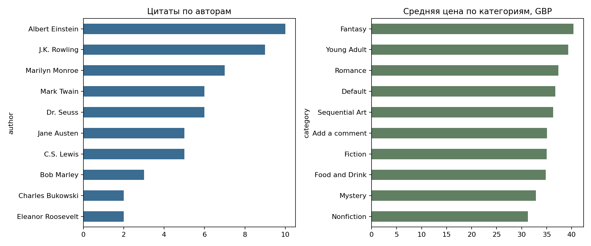
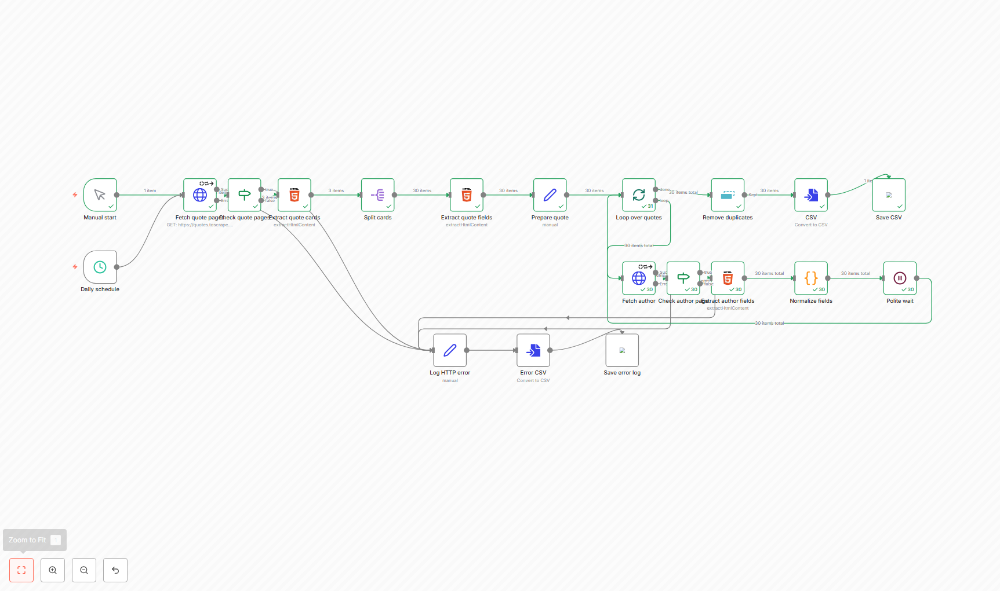
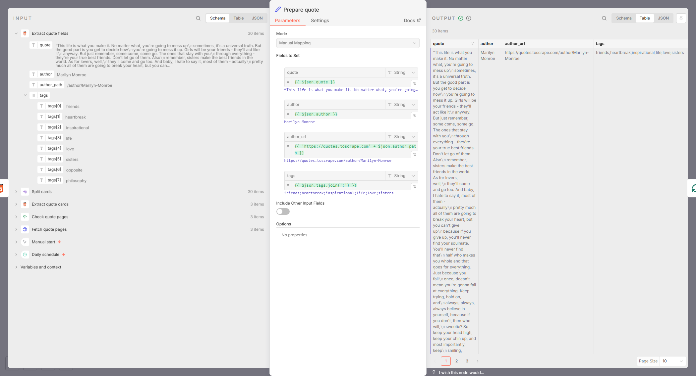

# Лабораторная 5. Отчёт

Вариант 3. С Quotes to Scrape собраны 100 цитат с десяти страниц.
Для объёма от 300 записей добавлен паук Books to Scrape.
В SQLite сохранены 100 цитат и 304 книги, всего 404 записи.

## Источники и пауки

Проект создан через `scrapy startproject`.
Схема записи — [items.py](labcrawler/items.py), пауки — [spiders](labcrawler/spiders),
обработка — [pipelines.py](labcrawler/pipelines.py).

Паук Quotes обходит список и страницы авторов. На первом уровне получает текст, автора и теги,
на втором — биографию, место и дату рождения.
Паук Books обходит каталог и страницы книг: название, рейтинг, UPC, цену без налога,
наличие, отзывы, категорию и описание.

Используется обычный Spider: для двух уровней с разными полями проще задать отдельные callback.
Данные первого уровня передаются через `cb_kwargs`, пагинация — через `response.follow`.
Scheduler управляет очередью и повторными URL, Downloader — HTTP-запросами,
Pipeline — очисткой и записью в базу. Сетевые ошибки учитываются через errback.

## Обработка и настройки

| Звено | Действие |
|---|---|
| 100 — валидация | Проверяет обязательные поля, DropItem и счётчик причины |
| 200 — очистка | Пробелы, цена float, количество int, дата ISO, регистр тегов и UPC |
| 300 — дедупликация | Книга по UPC, цитата по автору и тексту; состояние сохраняется для JOBDIR |
| 400 — SQLite | Соединение открывается один раз, executemany пакетами по 50, INSERT OR REPLACE |

Валидация и очистка считают отброшенные записи по причине:
пустые поля, неверные значения и повторный ключ.
Ключ книги — UPC, ключ цитаты — автор и текст.
SQLite записывает данные пакетами по 50 через `executemany` и `INSERT OR REPLACE`.

| Настройка | Значение и причина |
|---|---|
| ROBOTSTXT_OBEY | True |
| USER_AGENT | Учебное назначение |
| CONCURRENT_REQUESTS / PER_DOMAIN | 2 / 2 |
| DOWNLOAD_DELAY | 0,25 с с вариацией |
| AutoThrottle | Включён, target=1, задержка 0,3–3 с |
| DOWNLOAD_TIMEOUT | 25 с |
| RETRY_TIMES / CODES | 2; 429, 500, 502, 503, 504 |
| DEPTH_LIMIT | 25 |
| CLOSESPIDER_ITEMCOUNT | 300 |
| CLOSESPIDER_PAGECOUNT / TIMEOUT | 500 / 900 с |
| HTTPCACHE | Включён для отладки, срок 86400 с |
| LOG_LEVEL | INFO |

Два параллельных запроса и задержка ограничивают нагрузку.
AutoThrottle меняет задержку по времени ответа.
Лимиты записей, страниц и времени останавливают затянувшийся обход.
HTTP-кэш используется при повторных запусках.

## Остановка, продолжение и кэш

| Прогон | Записей | Время, с | Cache store | Cache hit | Dupefilter |
|---|---:|---:|---:|---:|---:|
| resume_1 | 35 | 20.078 | 58 | 25 | 0 |
| resume_2 | 65 | 18.516 | 56 | 73 | 1 |
| cache_1 | 100 | 36.781 | 114 | 97 | 0 |
| cache_2 | 100 | 2.750 | 0 | 211 | 0 |
| books_full | 304 | 10.906 | 0 | 326 | 0 |

Первый запуск Quotes остановлен на 35 записях, второй в том же JOBDIR добавил ещё 65.
Получены 100 уникальных цитат. Dupefilter во втором запуске отклонил один повторный запрос.
В [jobstate](jobstate) сохранены очередь, обработанные URL и ключи записей.

Два запуска с отдельным кэшем получили одинаковые 100 цитат.
Во втором было 211 попаданий в кэш и не было новых сетевых загрузок.
Статистика — в [data](data).

Books использовал заполненный кэш. При лимите 300 сохранились 304 книги:
после начала закрытия завершились уже запущенные запросы.
Обработано 20 страниц каталога.

## Качество данных

| Таблица | Строк | Уникальных ключей | Дублей | Пустых обязательных |
|---|---:|---:|---:|---:|
| quotes | 100 | 100 | 0 | 0 |
| books | 304 | 304 | 0 | 0 |

Полнота каждого поля — 100 %, подробности в [completeness.csv](quality/completeness.csv).
При сборе Books отброшена одна запись с пустым обязательным полем.
Ошибок в цене, рейтинге, наличии и числе отзывов нет.

Пример агрегатов:

| Категория | Книг | Средняя цена, GBP |
|---|---:|---:|
| Default | 52 | 36.74 |
| Nonfiction | 33 | 31.27 |
| Fiction | 23 | 34.97 |
| Sequential Art | 21 | 36.30 |
| Add a comment | 20 | 35.04 |

В [quality_report.ipynb](quality/quality_report.ipynb) посчитаны цитаты по авторам и тегам,
средние цены по категориям, коды ответов, повторы и трафик.

[smoke_check.py](quality/smoke_check.py) сравнивает два запуска.
Предупреждение появляется, если число записей упало больше чем на 20 %
или доля строк с пустыми обязательными полями превысила 5 %.
Для сохранённой базы предупреждений нет.

## n8n

[Workflow](nocode/workflow.json) получает три страницы цитат, разбирает карточки,
по очереди открывает страницы авторов, очищает поля и сохраняет CSV.
Между запросами есть пауза. В HTTP-узлах включены повторы,
неверные ответы и ошибки записываются отдельно.

Получены 30 цитат в [nocode_result.csv](nocode/nocode_result.csv).
Текст, автор, биография, место и дата рождения совпадают с SQLite.

## Сравнение

Для Scrapy взят полный запуск Quotes с изначально пустым кэшем.

| Показатель | Scrapy | n8n |
|---|---:|---:|
| Подготовка до первой выгрузки, мин | 0.40 | 17.64 |
| Цитат | 100 | 30 |
| Время, с | 36.78 | 38.64 |
| Записей в минуту | 163.1 | 46.6 |
| Сетевых запросов | 114 | 59 |
| Тел ответов, МБ | 0.107 | 0.143 |
| Дедупликация запросов | Scheduler; авторы дополнительно через кэш | По записям после обхода |
| Возобновление | JOBDIR | Повторный запуск небольшого workflow |
| Расписание и ошибки | Внешний запуск и журналы | Узлы расписания и ветка ошибки |
| Версионирование | Git | Экспорт JSON и Git |
| Усилия поддержки, субъективно 1–5 | 4 | 3 |

Время подготовки измерено до первой выгрузки, без установки окружения.
Scrapy получил 100 цитат, n8n — 30, поэтому также сравнивается число записей в минуту.

Для разового обхода 500 страниц выбран Scrapy: уже есть очередь, пагинация и база.
Для 40 000 страниц ежедневно также нужен Scrapy с состоянием и контролем нагрузки.
Для небольшого сбора с отправкой отчёта подходит n8n.
В совместной схеме n8n может запускать Scrapy и отправлять сводку из базы.

## Устойчивость и условия использования

Если изменятся классы `.quote`, `.author-description` или подписи таблицы,
поля могут пропасть. Такие изменения видны по полноте, счётчикам DropItem и smoke-check.
После изменения страницы нужно проверить селекторы на нескольких записях.

Сайты учебные, правила robots.txt учитываются, частота запросов ограничена.
Имена и биографии авторов могут относиться к персональным данным; контакты не собирались.
В правовой оценке учтён п. 8 ч. 1 ст. 6 [152-ФЗ](https://mintrud.gov.ru/docs/laws/130):
научная деятельность допускается при соблюдении прав и законных интересов человека.
Публичная страница не разрешает любое дальнейшее использование биографии.
Исходные биографии предлагается удалить не позднее чем через 30 дней после проверки.

Источники: [Quotes to Scrape](https://quotes.toscrape.com/), [Books to Scrape](https://books.toscrape.com/), [Scrapy JOBDIR](https://docs.scrapy.org/en/latest/topics/jobs.html), [AutoThrottle](https://docs.scrapy.org/en/latest/topics/autothrottle.html), [n8n HTML](https://docs.n8n.io/integrations/builtin/core-nodes/n8n-nodes-base.html/).
